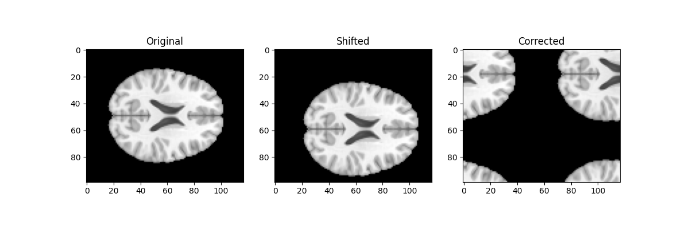

# MRI-LINAC Positioning AI Project

This project simulates patient positioning in MRI-guided radiotherapy (MRI-LINAC) and develops methods to detect and correct misalignment using both physics-based and AI-based approaches.

---

## 🚀 Key Features

- MRI data loading and visualization (nilearn)
- Simulation of patient positioning errors
- 2D and 3D image registration (cross-correlation)
- AI-based shift prediction using CNN (PyTorch)
- Comparison of classical vs AI methods

---

## 🧠 Methods

### Classical Approach
- Cross-correlation-based image registration
- Used to estimate spatial shift between images

### AI Approach
- Convolutional Neural Network (CNN)
- Learns mapping: MRI → spatial shift

---

## 📊 Results

### Image Alignment

---

## 🎯 Objective

To develop robust methods for detecting and correcting patient misalignment in MRI-guided radiotherapy, improving treatment accuracy and safety.

---

## 🛠 Technologies

- Python
- NumPy
- SciPy
- PyTorch
- Nilearn
- Matplotlib

---

## 👨‍💻 Author

Rajeevan
